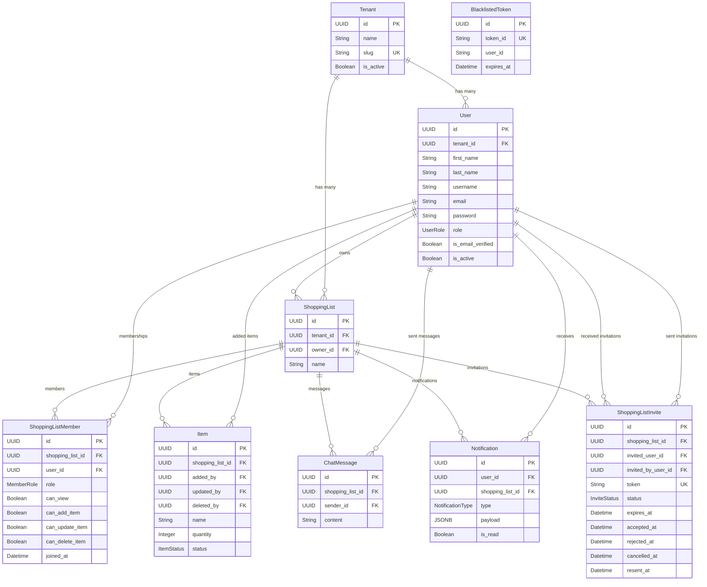

# MiniMart — Technical Documentation

> **Multi-tenant shopping list application with real-time synchronization**
>
> Version: `1.0.0`  |  Python `≥ 3.11`  |  FastAPI + SQLAlchemy (async) + Redis

---

## Table of Contents

1. [System Overview](#1-system-overview)
2. [Technology Stack](#2-technology-stack)
3. [Project Structure](#3-project-structure)
4. [Configuration & Environment](#4-configuration--environment)
5. [Data Model](#5-data-model)
6. [Enumerations](#6-enumerations)
7. [API Specification](#7-api-specification)
   - [Authentication](#71-authentication)
   - [Users](#72-users)
   - [Tenants](#73-tenants)
   - [Shopping Lists](#74-shopping-lists)
   - [Items](#75-items)
   - [Invitations](#76-invitations)
   - [Chat](#77-chat)
   - [Notifications](#78-notifications)
   - [Health](#79-health)
8. [WebSocket Protocol](#8-websocket-protocol)
9. [Security & Authentication](#9-security--authentication)
10. [Permission Matrix](#10-permission-matrix)
11. [Real-Time Event System](#11-real-time-event-system)
12. [Redis Service](#12-redis-service)
13. [Error Handling](#13-error-handling)
14. [Schemas Reference](#14-schemas-reference)
15. [Constants Reference](#15-constants-reference)

---

## 1. System Overview

MiniMart is a **multi-tenant**, real-time collaborative shopping list application. It allows organizations (tenants) to manage users who create, share, and collaborate on shopping lists. The system features:

- **Multi-tenancy** — Complete data isolation between tenants via tenant-scoped queries and foreign keys.
- **Real-time collaboration** — WebSocket-based live updates for list changes, chat messages, and notifications.
- **Role-based access control** — Two-tier permission system: platform-level roles (`SUPER_ADMIN`, `TENANT_ADMIN`, `USER`) and list-level roles (`OWNER`, `MEMBER` with granular permission flags).
- **Stateless invitations** — JWT-based invitation tokens with configurable expiration.
- **Soft-delete pattern** — All entities support soft deletion via `deleted_at` timestamps.

---

## 2. Technology Stack

| Component         | Technology                         | Purpose                                    |
|-------------------|------------------------------------|--------------------------------------------|
| **Framework**     | FastAPI `≥ 0.128.4`               | Async REST API + WebSocket endpoints       |
| **Server**        | Uvicorn `≥ 0.34.0`                | ASGI server with hot-reload in development |
| **ORM**           | SQLAlchemy `≥ 2.0.46` (async)     | Async PostgreSQL ORM with `asyncpg`        |
| **Database**      | PostgreSQL (via `asyncpg ≥ 0.30`) | Primary data store                         |
| **Migrations**    | Alembic `≥ 1.15.1`                | Schema migrations                          |
| **Cache / Pub-Sub** | Redis `≥ 5.2.1`                 | OTP storage, token blacklisting, invites   |
| **Auth**          | python-jose `≥ 3.4.0` (JWT)       | Token creation and validation              |
| **Password Hash** | argon2-cffi `≥ 25.1.0`            | Argon2 password hashing                    |
| **Validation**    | Pydantic `≥ 2.12.5`               | Request/response schema validation         |
| **Settings**      | pydantic-settings `≥ 2.8.1`       | Environment-based configuration            |
| **Email**         | aiosmtplib `≥ 3.0.3`              | Async SMTP for OTP and invitation emails   |
| **Task Queue**    | Celery `≥ 5.6.2`                  | Background task processing                 |
| **UUIDs**         | uuid6 `≥ 2024.2.25`               | UUIDv7 for time-ordered primary keys       |

---

## 3. Project Structure

```
app/
├── main.py                     # FastAPI app factory, lifespan, middleware
├── __init__.py
│
├── api/                        # REST API layer
│   ├── __init__.py
│   ├── router.py               # Top-level router (/api/v1 prefix)
│   ├── health.py               # Health check endpoints (/health)
│   └── v1/
│       ├── __init__.py
│       ├── router.py           # v1 sub-routers aggregation
│       ├── auth.py             # Authentication endpoints
│       ├── users.py            # User management endpoints
│       ├── tenants.py          # Tenant management endpoints
│       ├── shopping_lists.py   # Shopping list + member endpoints
│       ├── items.py            # Item CRUD endpoints
│       ├── invitations.py      # Invitation endpoints
│       ├── chat.py             # Chat message endpoints
│       └── notifications.py    # Notification endpoints
│
├── models/                     # SQLAlchemy models
│   ├── __init__.py             # Model registry & exports
│   ├── base.py                 # BaseModel (id, created_at, updated_at, deleted_at)
│   ├── tenant.py               # Tenant entity
│   ├── user.py                 # User entity
│   ├── shopping_list.py        # ShoppingList entity
│   ├── shopping_list_member.py # ShoppingListMember entity
│   ├── item.py                 # Item entity
│   ├── invitation.py           # ShoppingListInvite entity
│   ├── chat_message.py         # ChatMessage entity
│   ├── notification.py         # Notification entity
│   └── token_blacklist.py      # BlacklistedToken entity
│
├── schemas/                    # Pydantic schemas
│   ├── __init__.py
│   ├── common.py               # NormalizedModel, PaginatedResponse, MessageResponse
│   ├── auth.py                 # Auth request/response schemas
│   ├── user.py                 # User CRUD schemas
│   ├── tenant.py               # Tenant CRUD schemas
│   ├── shopping_list.py        # Shopping list schemas
│   ├── shopping_list_member.py # Member permission schemas
│   ├── item.py                 # Item schemas
│   ├── invitation.py           # Invitation schemas
│   ├── chat.py                 # Chat message schemas
│   └── notification.py         # Notification schemas
│
├── services/                   # Business logic layer
│   ├── __init__.py
│   ├── auth_service.py         # Authentication & token management
│   ├── user_service.py         # User CRUD operations
│   ├── tenant_service.py       # Tenant CRUD operations
│   ├── chat_service.py         # Chat message operations
│   ├── notification_service.py # Notification creation & delivery
│   ├── email_service.py        # Email sending (OTP, invitations)
│   ├── redis_service.py        # Redis operations (singleton)
│   ├── shopping_list/          # Shopping list domain services
│   │   ├── base.py             # BaseListService (access control, event publishing)
│   │   ├── list_service.py     # ShoppingListService
│   │   ├── item_service.py     # ListItemService
│   │   └── member_service.py   # ListMemberService
│   └── invitation/             # Invitation domain services
│       ├── action_service.py   # Accept/reject invitation actions
│       └── management_service.py # Send/cancel/resend invitations
│
├── core/                       # Core infrastructure
│   ├── config.py               # Settings (pydantic-settings)
│   ├── dependencies.py         # FastAPI dependencies (auth, pagination, ACL)
│   ├── security.py             # JWT, Argon2, OTP utilities
│   ├── logging.py              # Centralized logging setup
│   └── time.py                 # Timezone-aware time utilities
│
├── db/                         # Database infrastructure
│   ├── database.py             # Engine creation, init_db, close_db
│   └── session.py              # Async session factory & get_db dependency
│
├── websocket/                  # WebSocket layer
│   ├── __init__.py
│   ├── endpoints.py            # WS endpoint handlers (/ws, /ws/shopping-lists/{id}/chat)
│   ├── handlers.py             # Message routing (subscribe, unsubscribe, ping)
│   └── manager.py              # ConnectionManager singleton
│
├── middleware/
│   └── logging.py              # Request/response logging middleware
│
├── exceptions/                 # Custom exception hierarchy
│   ├── __init__.py             # Exception exports
│   ├── base.py                 # MiniMartException base class
│   ├── auth.py                 # Auth-related exceptions
│   ├── user.py                 # User/tenant exceptions
│   ├── validation.py           # Validation exceptions
│   └── handlers.py             # Global exception handlers
│
├── common/                     # Shared utilities
│   ├── enums.py                # Centralized enumerations
│   └── constants.py            # Magic strings, field lengths, WS events
│
├── tasks/                      # Celery background tasks
│   └── ...
│
└── utils/                      # General utilities
    └── ...
```

---

## 4. Configuration & Environment

All configuration is managed via **pydantic-settings** loaded from a `.env` file.

### Environment Variables

| Variable                         | Type       | Default                | Description                                |
|----------------------------------|------------|------------------------|--------------------------------------------|
| `APP_NAME`                       | `str`      | `MiniMart`             | Application display name                   |
| `APP_ENV`                        | `str`      | `development`          | Environment (`development` / `production`) |
| `DEBUG`                          | `bool`     | `false`                | Debug mode toggle                          |
| `SECRET_KEY`                     | `str`      | *required*             | Application secret key                     |
| `TIMEZONE`                       | `str`      | `Asia/Kolkata`         | Application timezone (IST)                 |
| `DATABASE_URL`                   | `str`      | *required*             | PostgreSQL connection string (asyncpg)     |
| `REDIS_URL`                      | `str`      | *required*             | Redis connection URL                       |
| `REDIS_TOKEN_DB`                 | `int`      | `1`                    | Redis DB index for token storage           |
| `JWT_SECRET_KEY`                 | `str`      | *required*             | JWT signing secret                         |
| `JWT_ALGORITHM`                  | `str`      | `HS256`                | JWT algorithm                              |
| `JWT_ACCESS_TOKEN_EXPIRE_MINUTES`| `int`      | *required*             | Access token TTL in minutes                |
| `JWT_REFRESH_TOKEN_EXPIRE_DAYS`  | `int`      | *required*             | Refresh token TTL in days                  |
| `INVITATION_TOKEN_EXPIRE_HOURS`  | `int`      | *required*             | Invitation token TTL in hours              |
| `INVITATION_BASE_URL`            | `str`      | *required*             | Frontend invite URL prefix                 |
| `SMTP_HOST`                      | `str`      | *required*             | SMTP server hostname                       |
| `SMTP_PORT`                      | `int`      | *required*             | SMTP server port                           |
| `SMTP_USER`                      | `str`      | *required*             | SMTP username                              |
| `SMTP_PASSWORD`                  | `str`      | *required*             | SMTP password                              |
| `EMAIL_FROM`                     | `str`      | *required*             | Sender email address                       |
| `EMAIL_FROM_NAME`                | `str`      | `MiniMart`             | Sender display name                        |
| `OTP_EXPIRE_MINUTES`             | `int`      | *required*             | OTP expiry in minutes                      |
| `OTP_LENGTH`                     | `int`      | *required*             | OTP digit count                            |
| `RATE_LIMIT_AUTH`                | `str`      | `5/minute`             | Auth endpoint rate limit                   |
| `RATE_LIMIT_INVITATION`          | `str`      | `10/hour`              | Invitation rate limit                      |
| `RATE_LIMIT_API`                 | `str`      | `100/minute`           | General API rate limit                     |
| `CORS_ORIGINS`                   | `list[str]`| `["http://localhost:3000","http://localhost:8000"]` | Allowed CORS origins |

### Environment-Dependent Behavior

| Feature                | `development`                       | `production`               |
|------------------------|-------------------------------------|----------------------------|
| Swagger UI (`/docs`)   | ✅ Enabled                          | ❌ Disabled                |
| ReDoc (`/redoc`)       | ✅ Enabled                          | ❌ Disabled                |
| Auto DB init           | ✅ `init_db()` on startup           | ❌ Manual migrations only  |
| Hot reload             | ✅ Uvicorn `reload=True`            | ❌ Disabled                |
| WS test pages          | ✅ `/test/chat`, `/test/notifications` | ❌ Not registered        |

---

## 5. Data Model

### 5.1 Base Model

All entities inherit from `BaseModel` which provides:

| Field        | Type                | Description                                |
|--------------|---------------------|--------------------------------------------|
| `id`         | `UUID` (UUIDv7)     | Time-ordered primary key                   |
| `created_at` | `datetime` (tz)     | Auto-set on creation                       |
| `updated_at` | `datetime` (tz)     | Auto-updated on modification               |
| `deleted_at` | `datetime?` (tz)    | Soft-delete timestamp (`NULL` = active)    |

### 5.2 Entity Relationship Diagram



### 5.3 Model Details

#### Tenant
- **Table**: `tenants`
- **Constraints**: `slug` is unique and indexed.
- **Relationships**: `users` (cascade), `shopping_lists` (cascade).

#### User
- **Table**: `users`
- **Constraints**: `(tenant_id, username)` unique, `(tenant_id, email)` unique.
- **Notes**: `tenant_id` is nullable to support Super Admins without tenant affiliation.
- **Relationships**: `tenant`, `owned_lists`, `list_memberships` (cascade), `added_items`, `sent_messages` (cascade), `notifications` (cascade), `sent_invitations` (cascade), `received_invitations` (cascade).

#### ShoppingList
- **Table**: `shopping_lists`
- **Indexes**: `tenant_id`, `owner_id`, `created_at`.
- **Computed Properties**: `item_count`, `pending_count`, `purchased_count`, `member_count`, `role` (dynamically attached by service).
- **Relationships**: `tenant`, `owner`, `members` (cascade), `items` (cascade, ordered by `created_at`), `chat_messages` (cascade, ordered by `created_at`), `notifications` (cascade), `invites` (cascade).

#### ShoppingListMember
- **Table**: `shopping_list_members`
- **Constraints**: `(shopping_list_id, user_id)` unique.
- **Permission Flags**: `can_view` (default: `true`), `can_add_item` (default: `false`), `can_update_item` (default: `false`), `can_delete_item` (default: `false`).
- **Computed Properties**: `username`, `email`, `is_owner`.

#### Item
- **Table**: `items`
- **Constraints**: `quantity >= 1` (check constraint).
- **Audit Fields**: `added_by`, `updated_by`, `deleted_by` (all nullable, `SET NULL` on user deletion).
- **Defaults**: `quantity = 1`, `status = PENDING`.

#### ChatMessage
- **Table**: `chat_messages`
- **Constraints**: `content` length ≤ 2000 (check constraint).
- **Indexes**: `shopping_list_id`, `sender_id`, composite `(shopping_list_id, created_at)`.

#### Notification
- **Table**: `notifications`
- **Indexes**: `user_id`, composite `(user_id, is_read)`, composite `(user_id, created_at)`, composite `(user_id, type)`.
- **Fields**: `payload` is a `JSONB` column for flexible notification data.

#### ShoppingListInvite
- **Table**: `shopping_list_invites`
- **Indexes**: `shopping_list_id`, `invited_user_id`, `invited_by_user_id`, `status`, `token` (unique).
- **Lifecycle Timestamps**: `expires_at`, `accepted_at`, `rejected_at`, `cancelled_at`, `resent_at`.

#### BlacklistedToken
- **Table**: `blacklisted_tokens`
- **Purpose**: Stores revoked JWT tokens (both access and refresh) that should be rejected even before their natural expiry.

---

## 6. Enumerations

### UserRole
Platform-level access control roles.

| Value          | Description                                         |
|----------------|-----------------------------------------------------|
| `SUPER_ADMIN`  | Platform administrator, manages tenants and tenant admins |
| `TENANT_ADMIN` | Tenant administrator, manages users within a tenant |
| `USER`         | Standard user, participates in shopping lists       |

### MemberRole
Shopping list membership roles.

| Value    | Description               |
|----------|---------------------------|
| `OWNER`  | List creator, full control |
| `MEMBER` | Invited collaborator       |

### ItemStatus
Shopping list item status.

| Value       | Description                  |
|-------------|------------------------------|
| `PENDING`   | Item not yet purchased       |
| `PURCHASED` | Item has been purchased      |

### InviteStatus
Invitation lifecycle states.

| Value       | Description                             |
|-------------|-----------------------------------------|
| `PENDING`   | Awaiting response                       |
| `ACCEPTED`  | User accepted the invitation            |
| `REJECTED`  | User rejected the invitation            |
| `EXPIRED`   | Token expired without response          |
| `CANCELLED` | Inviter cancelled the invitation        |

### NotificationType
Types of in-app notifications.

| Value             | Description                       |
|-------------------|-----------------------------------|
| `LIST_INVITE`     | New list invitation received      |
| `INVITE_ACCEPTED` | Invitation was accepted           |
| `INVITE_REJECTED` | Invitation was rejected           |
| `ITEM_ADDED`      | New item added to a list          |
| `ITEM_UPDATED`    | Item was updated                  |
| `ITEM_DELETED`    | Item was deleted                  |
| `ITEM_PURCHASED`  | Item marked as purchased          |
| `CHAT_MESSAGE`    | New chat message received         |
| `MEMBER_REMOVED`  | Member removed from list          |
| `LIST_UPDATED`    | Shopping list was updated         |

---

## 7. API Specification

**Base URL**: `/api/v1`

All authenticated endpoints require a JWT Bearer token in the `Authorization` header.  
Tenant-scoped endpoints require the `Tenant-ID` header (`UUID`).

### Common Response Schemas

**Paginated Response** — Used for all list endpoints:
```json
{
  "total": 50,
  "page": 1,
  "size": 20,
  "pages": 3,
  "data": [...]
}
```

**Message Response** — Used for action confirmations:
```json
{
  "message": "Action completed successfully"
}
```

### Pagination Parameters

| Parameter | Type  | Default | Range      | Description         |
|-----------|-------|---------|------------|---------------------|
| `page`    | `int` | `1`     | `≥ 1`     | Page number (1-based) |
| `size`    | `int` | `10`    | `1 – 100`  | Items per page       |

---

### 7.1 Authentication

**Prefix**: `/api/v1/auth`  
**Tag**: `Auth`

| Method | Path               | Auth | Headers      | Status | Description                       |
|--------|-------------------|------|-------------|--------|-----------------------------------|
| POST   | `/login`          | ❌   | `Tenant-ID?` | 200    | Login with email & password       |
| POST   | `/signup`         | ❌   | `Tenant-ID`  | 201    | Register a new user               |
| POST   | `/logout`         | ✅   | —           | 200    | Blacklist access + refresh tokens |
| POST   | `/verify-email`   | ❌   | `Tenant-ID`  | 200    | Verify email with OTP             |
| POST   | `/resend-otp`     | ❌   | `Tenant-ID`  | 200    | Resend verification OTP           |
| POST   | `/refresh`        | ❌   | —           | 200    | Refresh access + refresh tokens   |
| POST   | `/change-password`| ✅   | —           | 200    | Change current user's password    |
| POST   | `/forgot-password`| ❌   | `Tenant-ID?` | 200    | Request password reset email      |
| POST   | `/reset-password` | ❌   | —           | 200    | Reset password with reset token   |

#### Request/Response Bodies

<details>
<summary><strong>POST /login</strong></summary>

**Request:**
```json
{
  "email": "user@example.com",
  "password": "securepassword"
}
```

**Response (`LoginResponse`):**
```json
{
  "access_token": "eyJhbGciOi...",
  "refresh_token": "eyJhbGciOi..."
}
```
</details>

<details>
<summary><strong>POST /signup</strong></summary>

**Request:**
```json
{
  "email": "user@example.com",
  "username": "johndoe",
  "first_name": "John",
  "last_name": "Doe",
  "password": "SecurePass123"
}
```

**Response:** `MessageResponse` — `"Signup successful. Please verify your email."`
</details>

<details>
<summary><strong>POST /verify-email</strong></summary>

**Request:**
```json
{
  "email": "user@example.com",
  "otp": "123456"
}
```
</details>

<details>
<summary><strong>POST /logout</strong></summary>

**Request:**
```json
{
  "refresh_token": "eyJhbGciOi..."
}
```
</details>

<details>
<summary><strong>POST /change-password</strong></summary>

**Request:**
```json
{
  "current_password": "OldPass123",
  "new_password": "NewPass456"
}
```
</details>

<details>
<summary><strong>POST /reset-password</strong></summary>

**Request:**
```json
{
  "token": "eyJhbGciOi...",
  "new_password": "NewPass456",
  "confirm_password": "NewPass456"
}
```
</details>

---

### 7.2 Users

**Prefix**: `/api/v1/users`  
**Tag**: `Users`

| Method | Path          | Auth | Role Required           | Status | Description                 |
|--------|---------------|------|-------------------------|--------|-----------------------------|
| POST   | `/`           | ✅   | `TENANT_ADMIN` / `SUPER_ADMIN` | 201 | Create a new user         |
| GET    | `/`           | ✅   | `TENANT_ADMIN` / `SUPER_ADMIN` | 200 | List users (paginated)    |
| GET    | `/{user_id}`  | ✅   | Verified user           | 200    | Get user details           |
| PATCH  | `/{user_id}`  | ✅   | Verified user           | 200    | Update user profile        |
| DELETE | `/{user_id}`  | ✅   | Verified user           | 204    | Deactivate user (soft delete)|

**Role Behavior**:
- `SUPER_ADMIN` creates `TENANT_ADMIN` users (no tenant constraint).
- `TENANT_ADMIN` creates `USER` users (auto-assigns their tenant).
- `SUPER_ADMIN` sees all users; `TENANT_ADMIN` sees only their tenant's users.
- Admins see `UserAdminResponse`; regular users see `UserResponse`.

---

### 7.3 Tenants

**Prefix**: `/api/v1/tenants`  
**Tag**: `Tenants`

| Method | Path             | Auth | Role Required  | Status | Description           |
|--------|------------------|------|----------------|--------|-----------------------|
| POST   | `/`              | ✅   | `SUPER_ADMIN`  | 201    | Create a new tenant   |
| GET    | `/`              | ✅   | `SUPER_ADMIN`  | 200    | List tenants (paginated)|
| GET    | `/{tenant_id}`   | ✅   | `SUPER_ADMIN`  | 200    | Get tenant details    |
| PATCH  | `/{tenant_id}`   | ✅   | `SUPER_ADMIN`  | 200    | Update tenant         |
| DELETE | `/{tenant_id}`   | ✅   | `SUPER_ADMIN`  | 204    | Soft delete tenant    |

---

### 7.4 Shopping Lists

**Prefix**: `/api/v1/shopping-lists`  
**Tag**: `Shopping Lists`

| Method | Path                                  | Auth | Status | Description                        |
|--------|---------------------------------------|------|--------|------------------------------------|
| POST   | `/`                                   | ✅   | 201    | Create a shopping list             |
| GET    | `/`                                   | ✅   | 200    | List user's shopping lists (paginated) |
| GET    | `/{list_id}`                          | ✅   | 200    | Get list with members and items    |
| PATCH  | `/{list_id}`                          | ✅   | 200    | Update shopping list name          |
| DELETE | `/{list_id}`                          | ✅   | 204    | Delete shopping list               |
| GET    | `/{list_id}/members`                  | ✅   | 200    | List members (paginated)           |
| DELETE | `/{list_id}/members/{user_id}`        | ✅   | 200    | Remove a member                    |
| PATCH  | `/{list_id}/members/{user_id}`        | ✅   | 200    | Update member permissions          |

#### Member Permissions Update

```json
{
  "can_view": true,
  "can_add_item": true,
  "can_update_item": false,
  "can_delete_item": false
}
```

---

### 7.5 Items

**Prefix**: `/api/v1/shopping-lists`  
**Tag**: `Items`

| Method | Path                                     | Auth | Status | Description                     |
|--------|------------------------------------------|------|--------|---------------------------------|
| POST   | `/{list_id}/items`                       | ✅   | 201    | Add item to list                |
| GET    | `/{list_id}/items`                       | ✅   | 200    | List items (paginated, filterable) |
| GET    | `/{list_id}/items/{item_id}`             | ✅   | 200    | Get specific item               |
| PATCH  | `/{list_id}/items/{item_id}`             | ✅   | 200    | Update item                     |
| PATCH  | `/{list_id}/items/{item_id}/status`      | ✅   | 200    | Quick status toggle             |
| DELETE | `/{list_id}/items/{item_id}`             | ✅   | 204    | Delete item                     |

**Query Parameters** (GET `/{list_id}/items`):

| Parameter | Type         | Description                              |
|-----------|--------------|------------------------------------------|
| `status`  | `ItemStatus?`| Filter by `PENDING` or `PURCHASED`       |

---

### 7.6 Invitations

**Prefix**: `/api/v1/invitations` (actions) + `/api/v1/shopping-lists` (management)  
**Tag**: `Invitations`

| Method | Path                                  | Auth | Status | Description                      |
|--------|---------------------------------------|------|--------|----------------------------------|
| POST   | `/invitations/accept`                 | ✅   | 200    | Accept invitation by token       |
| POST   | `/invitations/reject`                 | ✅   | 200    | Reject invitation by token       |
| DELETE | `/invitations/{invite_id}`            | ✅   | 204    | Cancel a pending invitation      |
| POST   | `/invitations/{invite_id}/resend`     | ✅   | 200    | Resend invitation email          |
| GET    | `/shopping-lists/invites`             | ✅   | 200    | List all user's invitations      |
| POST   | `/shopping-lists/{list_id}/invite`    | ✅   | 201    | Invite user to list              |
| GET    | `/shopping-lists/{list_id}/invites`   | ✅   | 200    | List invitations for a list      |

**Query Parameters** (GET invite lists):

| Parameter | Type    | Description                                                    |
|-----------|---------|----------------------------------------------------------------|
| `status`  | `str?`  | Filter: `PENDING`, `ACCEPTED`, `REJECTED`, `CANCELLED`, `EXPIRED` |

---

### 7.7 Chat

**Prefix**: `/api/v1/shopping-lists`  
**Tag**: `Chat`

| Method | Path                                     | Auth | Status | Description                     |
|--------|------------------------------------------|------|--------|---------------------------------|
| GET    | `/{list_id}/messages`                    | ✅   | 200    | Load chat history (reverse chronological, paginated) |
| POST   | `/{list_id}/messages`                    | ✅   | 201    | Send a chat message (REST fallback) |
| DELETE | `/{list_id}/messages/{message_id}`       | ✅   | 204    | Soft-delete a message           |

---

### 7.8 Notifications

**Prefix**: `/api/v1/notifications`  
**Tag**: `Notifications`

| Method | Path                          | Auth | Status | Description                      |
|--------|-------------------------------|------|--------|----------------------------------|
| GET    | `/`                           | ✅   | 200    | List notifications (paginated, filterable) |
| PATCH  | `/{notification_id}/read`     | ✅   | 200    | Mark notification as read        |
| PATCH  | `/read-all`                   | ✅   | 200    | Mark all unread as read          |

**Query Parameters** (GET):

| Parameter | Type    | Description                    |
|-----------|---------|--------------------------------|
| `is_read` | `bool?` | Filter by read/unread status   |

---

### 7.9 Health

**Prefix**: `/health`  
**Tag**: `Health`

| Method | Path     | Auth | Status | Description                             |
|--------|----------|------|--------|-----------------------------------------|
| GET    | `/`      | ❌   | 200    | Liveness check (always responds)        |
| GET    | `/ready` | ❌   | 200/503| Readiness check (DB + Redis connectivity)|

---

## 8. WebSocket Protocol

MiniMart uses two WebSocket endpoints with distinct scopes.

### 8.1 Global WebSocket — `/ws`

**Connection**: `ws://host/ws?token=<jwt_access_token>`

**Purpose**: Receives real-time events for subscribed lists and notifications.

**Scope**: `global` — This connection receives list events (for subscribed lists) and notifications.

#### Client → Server Messages

| Type          | Payload                    | Description                     |
|---------------|----------------------------|---------------------------------|
| `subscribe`   | `{ "list_id": "<uuid>" }`  | Subscribe to list events        |
| `unsubscribe` | `{ "list_id": "<uuid>" }`  | Unsubscribe from list events    |
| `ping`        | `{}`                       | Keep-alive ping                 |

#### Server → Client Messages

| Type           | Payload                                                  | Description                        |
|----------------|----------------------------------------------------------|------------------------------------|
| `connected`    | `{}`                                                     | Connection confirmation            |
| `subscribed`   | `{ "list_id": "<uuid>" }`                               | Subscription confirmed             |
| `unsubscribed` | `{ "list_id": "<uuid>" }`                               | Unsubscription confirmed           |
| `event`        | `{ "event": "<type>", "list_id": "<uuid>", "data": {} }`| List event broadcast               |
| `notification` | `{ "id", "type", "data", "list_id", "created_at" }`     | Notification delivery              |
| `kicked`       | `{ "list_id": "<uuid>", "reason": "..." }`              | User kicked from list              |
| `pong`         | `{}`                                                     | Ping response                      |
| `error`        | `{ "message": "..." }`                                   | Error message                      |

### 8.2 Chat WebSocket — `/ws/shopping-lists/{list_id}/chat`

**Connection**: `ws://host/ws/shopping-lists/{list_id}/chat?token=<jwt_access_token>`

**Purpose**: Dedicated real-time chat for a specific shopping list.

**Scope**: `chat:{list_id}` — This connection only receives chat messages for the specified list. **Does NOT receive notifications.**

#### Client → Server Messages

| Type           | Payload                   | Description                |
|----------------|---------------------------|----------------------------|
| `chat_message` | `{ "message": "..." }`    | Send a chat message        |
| `ping`         | `{}`                      | Keep-alive ping            |

#### Server → Client Messages

| Type           | Payload                                                  | Description                |
|----------------|----------------------------------------------------------|----------------------------|
| `connected`    | `{ "list_id": "<uuid>" }`                               | Connection confirmation    |
| `chat_message` | `{ "id", "sender_id", "sender_name", "message", ... }`  | Chat message broadcast     |
| `pong`         | `{}`                                                     | Ping response              |
| `error`        | `{ "message": "..." }`                                   | Error message              |

### 8.3 Connection Manager Architecture

The `ConnectionManager` is an in-memory singleton managing:

- **`active_connections`**: `{ user_id → { WebSocket → scope } }` — Tracks all connections per user with their scope.
- **`list_subscribers`**: `{ list_id → Set[(user_id, WebSocket)] }` — Tracks which connections are subscribed to which lists.
- **`connection_subscriptions`**: `{ (user_id, WebSocket) → Set[list_id] }` — Reverse mapping for quick cleanup on disconnect.

#### Key Behaviors

1. **Notification isolation**: Notifications are only delivered to `global` scoped connections, never to `chat:{list_id}` scoped connections.
2. **Subscription-based suppression**: If a user has an active subscription to a list, notifications about that list are suppressed (they already see the events).
3. **Member removal handling**: When a member is removed/leaves, the manager sends a `kicked` event to the user, closes their scoped connections, and unsubscribes them from the list.
4. **Logout cleanup**: `disconnect_all_for_user()` closes all WebSocket connections for a user immediately with close code `4001`.

---

## 9. Security & Authentication

### 9.1 Password Security

- **Algorithm**: Argon2 (via `argon2-cffi`)
- **Policy**:
  - Minimum length: 8 characters
  - Maximum length: 128 characters
  - Must contain: uppercase, lowercase, digit

### 9.2 JWT Token Types

| Token Type       | `type` Claim    | Expiry                            | Contains                                   |
|------------------|-----------------|-----------------------------------|--------------------------------------------|
| **Access**       | `access`        | Configurable (minutes)            | `sub`, `tenant_id`, `role`, `email`, `jti` |
| **Refresh**      | `refresh`       | Configurable (days)               | `sub`, `tenant_id`, `jti`                  |
| **Invitation**   | `list_invite`   | Configurable (hours)              | `list_id`, `email`, `tenant_id`, `inviter_id`, `jti` |
| **Password Reset**| `password_reset`| 15 minutes (hardcoded)           | `sub`, `tenant_id`, `jti`                  |

All tokens use `HS256` algorithm and include `iat` (issued at) and `exp` (expiration) claims.

### 9.3 Token Blacklisting

Tokens are blacklisted on logout using Redis with TTL matching the token's remaining expiry:

- **Access tokens**: Redis key `blacklist:access:{jti}` — Checked on every authenticated request and WebSocket connection.
- **Refresh tokens**: Redis key `blacklist:{jti}` — Checked on token refresh.

### 9.4 OTP Flow

1. On signup, a 6-digit OTP is generated and stored in Redis (`otp:{tenant_id}:{email}`).
2. OTP is sent to the user's email via async SMTP.
3. User submits OTP via `/verify-email` endpoint.
4. On success, `is_email_verified` is set to `true` and OTP is deleted from Redis.

### 9.5 Input Normalization

All request schemas inherit from `NormalizedModel` which:
- **Strips** whitespace from all string fields.
- **Lowercases** all string fields except: `password`, `token`, `otp`, `role`, `status`, `type`, etc. (defined in `NORMALIZATION_BYPASS_FIELDS`).

---

## 10. Permission Matrix

### 10.1 Platform-Level Roles

| Action                     | `SUPER_ADMIN` | `TENANT_ADMIN` | `USER` |
|----------------------------|:---:|:---:|:---:|
| Create tenant              | ✅  | ❌  | ❌  |
| Manage tenants (CRUD)      | ✅  | ❌  | ❌  |
| Create `TENANT_ADMIN` user | ✅  | ❌  | ❌  |
| Create `USER`              | ❌  | ✅  | ❌  |
| List all users             | ✅  | ❌  | ❌  |
| List tenant users          | ✅  | ✅  | ❌  |
| View user (admin detail)   | ✅  | ✅  | ❌  |
| View user (basic)          | ✅  | ✅  | ✅  |

### 10.2 Shopping List Roles

| Action                    | `OWNER`             | `MEMBER` (w/ permission) | `MEMBER` (default) | `TENANT_ADMIN` |
|---------------------------|:---:|:---:|:---:|:---:|
| Create list               | ✅ (auto-assigned)  | —                        | —                  | ✅              |
| View list                 | ✅                  | ✅ (`can_view`)           | ✅                 | ✅ (elevated)   |
| Update list               | ✅                  | ❌                        | ❌                 | ✅ (elevated)   |
| Delete list               | ✅                  | ❌                        | ❌                 | ✅ (elevated)   |
| Add items                 | ✅                  | ✅ (`can_add_item`)       | ❌                 | ✅ (elevated)   |
| Update items              | ✅                  | ✅ (`can_update_item`)    | ❌                 | ✅ (elevated)   |
| Delete items              | ✅                  | ✅ (`can_delete_item`)    | ❌                 | ✅ (elevated)   |
| Invite members            | ✅                  | ❌                        | ❌                 | ✅ (elevated)   |
| Remove members            | ✅                  | ❌                        | ❌                 | ✅ (elevated)   |
| Update member permissions | ✅                  | ❌                        | ❌                 | ✅ (elevated)   |
| Leave list                | ❌ (is owner)       | ✅                        | ✅                 | ✅              |

---

## 11. Real-Time Event System

### 11.1 WebSocket Event Types

Events are broadcast to all subscribed connections via the `broadcast_event` method.

| Event Constant                | Value                  | Triggered By            | Payload Includes             |
|-------------------------------|------------------------|-------------------------|------------------------------|
| `WS_EVENT_ITEM_ADDED`        | `item_added`           | Add item                | Item details                 |
| `WS_EVENT_ITEM_UPDATED`      | `item_updated`         | Update item             | Updated item details         |
| `WS_EVENT_ITEM_DELETED`      | `item_deleted`         | Delete item             | Item ID                      |
| `WS_EVENT_MEMBER_JOINED`     | `member_joined`        | Accept invitation       | Member details               |
| `WS_EVENT_MEMBER_REMOVED`    | `member_removed`       | Remove member           | User ID, kicks user          |
| `WS_EVENT_MEMBER_LEFT`       | `member_left`          | Leave list              | User ID, kicks user          |
| `WS_EVENT_INVITE_CREATED`    | `invite_created`       | Send invitation         | Invite details               |
| `WS_EVENT_INVITE_ACCEPTED`   | `invite_accepted`      | Accept invitation       | Invite details               |
| `WS_EVENT_INVITE_REJECTED`   | `invite_rejected`      | Reject invitation       | Invite details               |
| `WS_EVENT_INVITE_CANCELLED`  | `invite_cancelled`     | Cancel invitation       | Invite details               |
| `WS_EVENT_LIST_UPDATED`      | `list_updated`         | Update list             | Updated list details         |
| `WS_EVENT_LIST_DELETED`      | `list_deleted`         | Delete list             | List ID                      |
| `WS_EVENT_CHAT_MESSAGE`      | `chat_message`         | Send chat message       | Message details              |
| `WS_EVENT_PERMISSIONS_UPDATED`| `permissions_updated` | Update permissions      | Permission details           |

### 11.2 Event Delivery Rules

1. **List events** → Delivered to all subscribed connections for the list.
2. **Chat messages** → Delivered only to `chat:{list_id}` scoped connections (`only_scoped: true`).
3. **Notifications** → Delivered only to `global` scoped connections, excluding connections subscribed to the related list.
4. **Actor inclusion** → The user performing the action **does** receive the event broadcast (for dashboard synchronization). They do **not** receive the notification (they're the actor).

---

## 12. Redis Service

The `RedisService` is a class-level singleton with two connection pools:

| Pool           | Config              | Purpose                                                 |
|----------------|---------------------|---------------------------------------------------------|
| **Main**       | `REDIS_URL` (DB 0)  | General cache and pub/sub (reserved for future use)      |
| **Token**      | `REDIS_URL` (DB 1)  | OTP, token blacklisting, invitation tokens, password resets |

### Key Patterns

| Key Pattern                        | TTL                     | Purpose                              |
|------------------------------------|-------------------------|--------------------------------------|
| `otp:{tenant_id}:{email}`         | `OTP_EXPIRE_MINUTES`    | Email verification OTP               |
| `invite:{jti}`                    | `INVITATION_TOKEN_EXPIRE_HOURS` | Invitation token validation |
| `blacklist:{jti}`                 | Remaining token TTL     | Refresh token blacklist              |
| `blacklist:access:{jti}`          | Remaining token TTL     | Access token blacklist               |
| `password_reset:{user_id}`        | 15 minutes              | One-at-a-time password reset JTI     |

---

## 13. Error Handling

### Exception Hierarchy

```
MiniMartException (base)
├── UnauthorizedException (401)
├── CredentialsException (401)
├── EmailNotVerifiedException (403)
├── ForbiddenException (403)
├── InvitationExpiredException (400)
├── InvitationAlreadyUsedException (400)
├── NotFoundException (404)
├── ConflictException (409)
├── TenantInactiveException (403)
├── RateLimitException (429)
└── ValidationException (422)
```

### Error Response Format

```json
{
  "success": false,
  "error": {
    "code": "ERROR_CODE",
    "message": "Human-readable error message",
    "details": {}
  }
}
```

### WebSocket Close Codes

| Code   | Constant               | Meaning                              |
|--------|------------------------|--------------------------------------|
| `4001` | `WS_CLOSE_AUTH_FAILED` | Authentication failed / token revoked |
| `4003` | `WS_CLOSE_FORBIDDEN`   | Not a member / access denied          |

---

## 14. Schemas Reference

### Auth Schemas

| Schema                 | Type     | Fields                                                          |
|------------------------|----------|-----------------------------------------------------------------|
| `LoginRequest`         | Request  | `email` (EmailStr), `password` (1–128 chars)                    |
| `LoginResponse`        | Response | `access_token`, `refresh_token`                                 |
| `SignupRequest`        | Request  | `email`, `username` (3–100, alphanumeric+underscore), `first_name`, `last_name`, `password` (8–128) |
| `LogoutRequest`        | Request  | `refresh_token`                                                 |
| `RefreshTokenRequest`  | Request  | `refresh_token`                                                 |
| `VerifyEmailRequest`   | Request  | `email`, `otp` (6 digits)                                      |
| `ResendOtpRequest`     | Request  | `email`                                                         |
| `OTPResponse`          | Response | `message`, `expires_in` (seconds)                               |
| `PasswordResetRequest` | Request  | `email`                                                         |
| `PasswordResetConfirm` | Request  | `token`, `new_password`, `confirm_password`                     |
| `ChangePasswordRequest`| Request  | `current_password`, `new_password`                              |

### User Schemas

| Schema             | Type     | Fields                                                          |
|--------------------|----------|-----------------------------------------------------------------|
| `UserCreate`       | Request  | `email`, `username`, `first_name`, `last_name`, `password`, `tenant_id?` |
| `UserUpdate`       | Request  | `username?`, `first_name?`, `last_name?`, `is_active?`, `deleted_at?` |
| `UserResponse`     | Response | `id`, `email`, `username`, `first_name`, `last_name`, `tenant_id?` |
| `UserAdminResponse`| Response | Extends `UserResponse` + `role`, `is_email_verified`, `is_active`, `deleted_at?`, `created_at` |

### Tenant Schemas

| Schema                | Type     | Fields                                |
|-----------------------|----------|---------------------------------------|
| `TenantCreate`        | Request  | `name`, `slug` (lowercase, hyphens)   |
| `TenantUpdate`        | Request  | `name?`, `slug?`, `is_active?`, `deleted_at?` |
| `TenantResponse`      | Response | `id`, `name`, `slug`, `created_at`    |
| `TenantDetailResponse`| Response | Extends `TenantResponse` + `is_active`, `updated_at`, `deleted_at?` |

### Shopping List Schemas

| Schema                       | Type     | Fields                                                              |
|------------------------------|----------|---------------------------------------------------------------------|
| `ShoppingListCreate`         | Request  | `name`                                                              |
| `ShoppingListUpdate`         | Request  | `name?`                                                             |
| `ShoppingListResponse`       | Response | `id`, `name`, `tenant_id`, `owner_id`, `created_at`, `updated_at`  |
| `ShoppingListDetailResponse` | Response | Extends above + `members[]`, `items[]`, `item_count`, `pending_count`, `purchased_count` |
| `ShoppingListSummaryResponse`| Response | `id`, `name`, `role`, `item_count`, `member_count`, `created_at`   |

### Item Schemas

| Schema           | Type     | Fields                                                                             |
|------------------|----------|------------------------------------------------------------------------------------|
| `ItemCreate`     | Request  | `name`, `quantity` (default: 1, range: 1–1,000,000)                                |
| `ItemUpdate`     | Request  | `name?`, `quantity?`, `status?`                                                    |
| `ItemStatusUpdate`| Request | `status` (PENDING / PURCHASED)                                                     |
| `ItemResponse`   | Response | `id`, `name`, `quantity`, `shopping_list_id`, `status`, `added_by?`, `updated_by?`, `deleted_by?`, `created_at`, `updated_at`, `deleted_at?` |

### Invitation Schemas

| Schema                   | Type     | Fields                                                                      |
|--------------------------|----------|-----------------------------------------------------------------------------|
| `InviteRequest`          | Request  | `user_id`                                                                   |
| `InviteResponse`         | Response | `message`, `expires_at`                                                     |
| `InvitationAcceptRequest`| Request  | `token`                                                                     |
| `InvitationRejectRequest`| Request  | `token`                                                                     |
| `InvitationResponse`     | Response | `id`, `shopping_list_id`, `list_name?`, `invited_user_id`, `invited_email?`, `invited_username?`, `invited_by_user_id`, `invited_by_username?`, `status`, `expires_at`, `created_at`, `accepted_at?`, `rejected_at?`, `cancelled_at?`, `resent_at?` |

### Chat Schemas

| Schema               | Type     | Fields                                                       |
|----------------------|----------|--------------------------------------------------------------|
| `ChatMessageRequest` | Request  | `message` (1–2000 chars)                                     |
| `ChatMessageResponse`| Response | `id`, `shopping_list_id`, `sender_id`, `sender_name`, `message`, `created_at` |

### Notification Schemas

| Schema                | Type     | Fields                                                              |
|-----------------------|----------|---------------------------------------------------------------------|
| `NotificationResponse`| Response | `id`, `user_id`, `shopping_list_id?`, `type`, `payload`, `is_read`, `created_at` |

### Member Schemas

| Schema                   | Type     | Fields                                                                |
|--------------------------|----------|-----------------------------------------------------------------------|
| `MemberResponse`         | Response | `id`, `user_id`, `username`, `email`, `role`, `can_view`, `can_add_item`, `can_update_item`, `can_delete_item`, `joined_at` |
| `UpdateMemberPermissions`| Request  | `can_view?`, `can_add_item?`, `can_update_item?`, `can_delete_item?`  |

---

## 15. Constants Reference

### Field Length Limits

| Constant                     | Value    | Used For                        |
|------------------------------|----------|---------------------------------|
| `MAX_LENGTH_NAME`            | 255      | Names (user, tenant, list, item)|
| `MIN_LENGTH_NAME`            | 1        | Minimum name length             |
| `MAX_LENGTH_EMAIL`           | 255      | Email addresses                 |
| `MAX_LENGTH_PASSWORD_HASH`   | 255      | Stored password hash length     |
| `MAX_LENGTH_PASSWORD_RAW`    | 128      | Raw password input              |
| `MIN_LENGTH_PASSWORD`        | 8        | Minimum password length         |
| `MAX_LENGTH_TOKEN`           | 1024     | JWT token strings               |
| `MAX_LENGTH_USERNAME`        | 100      | Username field                  |
| `MIN_LENGTH_USERNAME`        | 3        | Minimum username length         |
| `MAX_LENGTH_SLUG`            | 100      | Tenant slug field               |
| `MAX_LENGTH_UUID_STR`        | 36       | UUID string representation      |
| `MAX_CHAT_MESSAGE_LENGTH`    | 2000     | Chat message content            |

### Item Constraints

| Constant                | Value       |
|-------------------------|-------------|
| `MIN_ITEM_QUANTITY`     | 1           |
| `MAX_ITEM_QUANTITY`     | 1,000,000   |
| `DEFAULT_ITEM_QUANTITY` | 1           |

### Pagination Defaults

| Constant             | Value |
|----------------------|-------|
| `DEFAULT_PAGE`       | 1     |
| `DEFAULT_PAGE_SIZE`  | 20    |
| `MAX_PAGE_SIZE`      | 100   |
| `MIN_PAGE_SIZE`      | 1     |
| `DEFAULT_CHAT_LIMIT` | 50    |
| `MAX_CHAT_LIMIT`     | 100   |

### Validation Patterns

| Constant         | Pattern               | Used For                 |
|------------------|-----------------------|--------------------------|
| `REGEX_USERNAME`  | `^[a-zA-Z0-9_]+$`    | Username validation      |
| `REGEX_SLUG`      | `^[a-z0-9-]+$`       | Tenant slug validation   |

---

*Generated from MiniMart v1.0.0 codebase analysis.*
